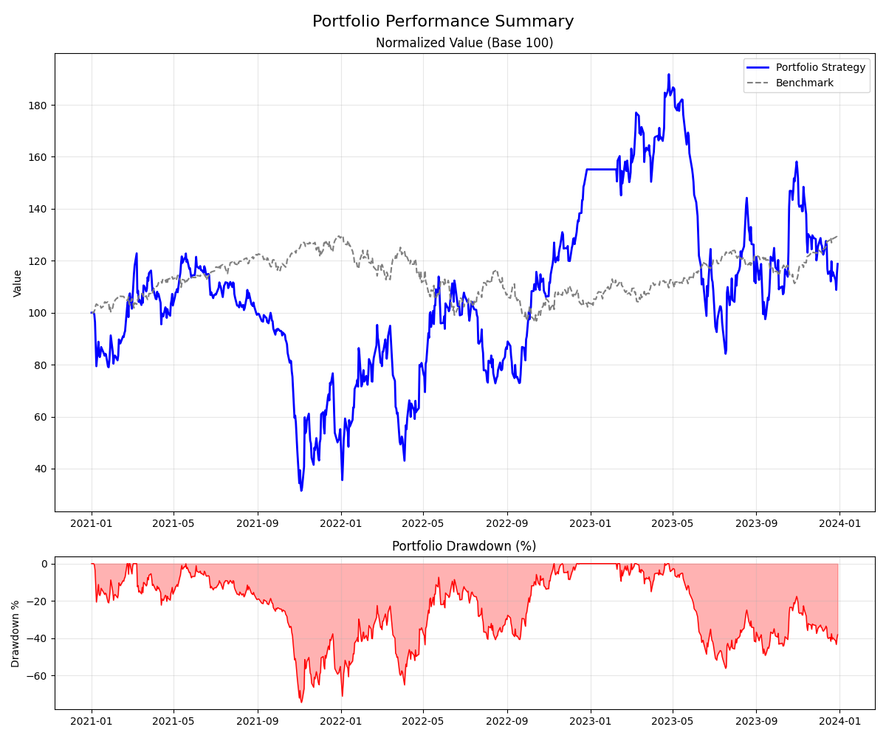

# Portfolio Backtester with Transaction Logging
This is a custom-built Python framework designed to backtest trading 
strategies using real-world data. It combines a calculation engine (wrapping the Yahoo Finance API) with an in-memory, DataFrame-based portfolio management system to track portfolio performance and log transactions.

This project bridges the gap between simple data fetching and actual portfolio tracking, 
allowing you to simulate trades, manage a cash balance, and store your trading history temporarily within the application's runtime.

## ⚙ Key Features ⚙
### The Calculation Motor: 

A helpful wrapper around yfinance that fetches price history and facilitates the 
 calculation of basic fundamental metrics (like TTM EPS and PE Ratios).

### In-Memory Portfolio Management: 
 
Uses Pandas DataFrames to store a log of all BUY and SELL events, manage current positions, and track portfolio value history. Data is managed in-memory during runtime.

### Automated Cash Management: 

Automatically deducts cost from your cash balance when you buy and credits cash when 
 you sell.

### Fractional Shares: 

Full support for fractional trading (e.g., buying 0.5 shares).

### 📉 Short Selling Engine:

The `PortfolioManager` natively supports `SHORT` and `COVER` trades. It automatically enforces a 100% margin requirement and tracks negative share balances, allowing you to build and test strategies that profit when the market goes down!

#### Example: PE Short Strategy on Tesla (TSLA)
We implemented a sample strategy (`pe_short`) that shorts a stock when it is massively overvalued (P/E > 50) and covers the position when the valuation returns to earth (P/E < 30).

As seen in the backtest below, the strategy successfully shorted TSLA before the 2022 tech crash, and executed a perfect COVER trade at the bottom!



### 🛡️ Quantitative Risk & Factor Metrics (Daily Series & Summary)

The framework includes institutional-grade risk metrics available both as **daily rolling time series** (to inspect day-by-day or build dynamic risk-budgeting strategies) and as **end-of-backtest summary metrics**.

#### 1. Daily Rolling Risk Retrieval (via Calculation Motor)
You can query daily risk measures for any asset over a rolling window (e.g., 60 days) just like daily P/E ratios or Close prices:

```python
from portfolio_test.motor import CalculationMotor

motor = CalculationMotor("SPY", start="2022-01-01", end="2023-01-01")

# 1. Daily Rolling Volatility (annualized)
daily_vol = motor.get_daily_rolling_volatility(window=60)

# 2. Daily Rolling Value at Risk (95% Historical VaR)
daily_var = motor.get_daily_rolling_var(window=60, confidence_level=0.95)

# 3. Daily Rolling Expected Shortfall (95% Historical CVaR)
daily_cvar = motor.get_daily_rolling_cvar(window=60, confidence_level=0.95)

# 4. Or retrieve all daily metrics in a single unified DataFrame:
daily_risk_df = motor.get_daily_rolling_risk_metrics(window=60)
print(daily_risk_df.tail())
```

#### 2. Dynamic Risk Management in Strategies
Because risk metrics are calculated for every single day, your strategies can monitor risk in real time during the backtest:

```python
# Example: Inside a Strategy's execute() loop
for date in data.index:
    pm.update_portfolio_prices(data.loc[date])
    
    current_var = data.loc[date, 'Rolling_VaR_95']
    
    # If 95% daily expected tail risk exceeds 2.5%, automatically de-risk to Cash
    if current_var > 0.025 and in_position:
        pm.record_transaction_percentage_buy_sell(
            tx_type="SELL", ticker="SPY", pcnt_of_portfolio=1.0, data_one_date=data.loc[date]
        )
        in_position = False
```

#### 3. Portfolio-Level Daily Risk Time Series
You can extract the full historical day-by-day risk profile of your simulated portfolio from `PortfolioStatisticsService`:

```python
pss = PortfolioStatisticsService(pm, benchmark_series=benchmark_prices)

# Returns a daily DataFrame indexed by date
rolling_portfolio_risk = pss.get_daily_rolling_metrics(window=60)
# Available columns:
# - Daily_Return
# - Rolling_Volatility (Annualized)
# - Rolling_VaR_95 (Historical daily 95% loss ceiling)
# - Rolling_CVaR_95 (Expected Shortfall during worst 5% tail days)
# - Rolling_Sharpe
# - Drawdown (Daily drawdown from all-time high)
# - Rolling_Beta (Systematic sensitivity to benchmark)
# - Rolling_Alpha (Jensen's annualized excess return)
# - Rolling_Correlation
```

#### 4. Metrics Explained

| Metric | Type | What it Measures |
| :--- | :--- | :--- |
| **Historical $\text{VaR}_{95\%}$** | Tail Risk | Maximum expected daily loss on 95% of trading days. |
| **Expected Shortfall ($\text{CVaR}_{95\%}$)** | Tail Risk | The average daily loss during the worst 5% crash days. |
| **Sortino Ratio** | Risk-Adjusted Return | Annualized excess return divided by **downside volatility only** (penalizes downside drops, not upside surges). |
| **Calmar Ratio** | Drawdown Adjusted | Annualized Return divided by Maximum Drawdown ($\frac{\text{CAGR}}{\|\text{Max DD}\|}$). |
| **Market Beta ($\beta$)** | Factor Exposure | Portfolio sensitivity to benchmark movements ($\beta = 0.22$ means the portfolio moves only 22% as violently as the index). |
| **Jensen's Alpha ($\alpha$)** | Alpha Generation | Annualized excess return generated above the CAPM expected benchmark return. |

---

### Project Structure

- **`motor.py` (The Calculation Motor)**: The "Engine" wrapper around yfinance that fetches OHLC price history and computes fundamental metrics (TTM EPS, P/E) and quantitative daily risk metrics (Rolling Volatility, VaR, CVaR, Beta).
- **`forge_data.py` (The Data Forger)**: Responsible for aggregating various data series into a unified DataFrame.
- **`portfolio_manager.py` (The Portfolio Manager)**: Manages the in-memory portfolio using DataFrames. Handles buy/sell/short/cover transactions, cash interest sweep, and realistic friction costs (fees & slippage).
- **`portfolio_service.py` (The Portfolio Statistics Service)**: Comprehensive risk and performance engine. Calculates Sharpe, Sortino, Calmar, Historical & Parametric VaR, CVaR, Beta, Alpha, and daily rolling risk series.
- **`trading_strategy_*.ipynb` (Jupyter Notebooks)**: Workspaces where you design and backtest your strategies.

// Signed off by Anton